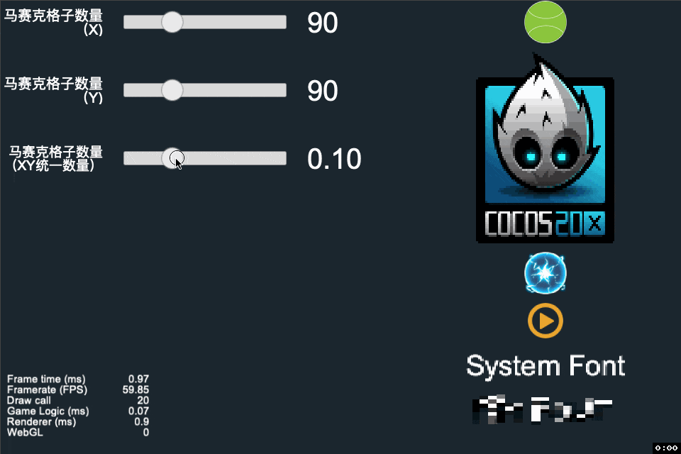
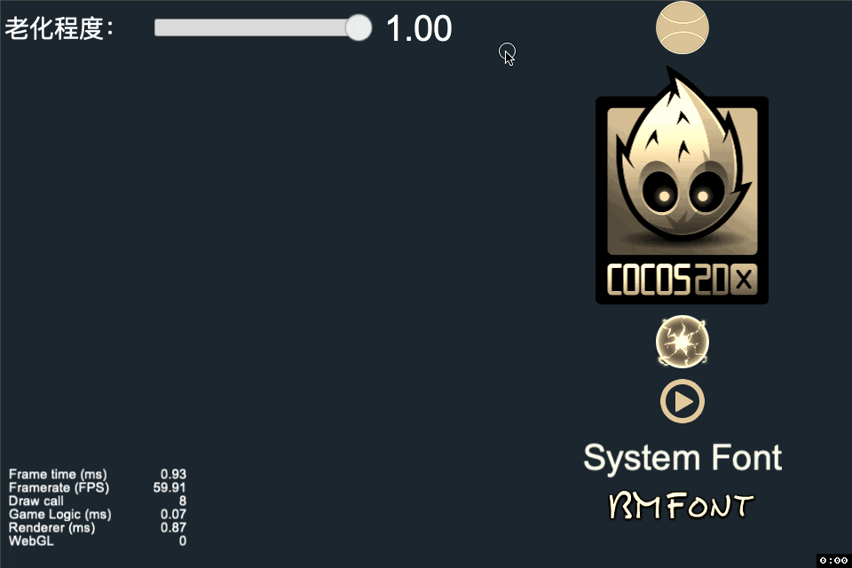
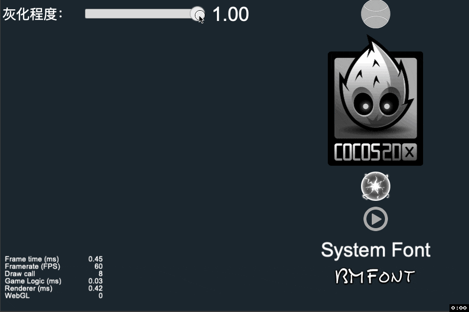

# Cocos Creator Shader Effect Demo

## 项目说明

1. 此项目为我在学习过程中的一些分享和实现，因此项目名字以 **`Demo`** 为后缀。
2. 项目重点在于 **「渔」**，不在于 **「鱼」** 。
3. 如果你有意将此Demo中的效果加入到你的项目中，**请认真评估是否适合你的项目使用！**

## 系列文章

* [Cocos Creator Shader Effect 系列 - 0 - 前言](https://www.jianshu.com/p/20b906d7269c)
* [Cocos Creator Shader Effect 系列 - 1 - 材质，Effect，Inspector，纹理之间的关系](https://www.jianshu.com/p/ca28666d25d2)
* [Cocos Creator Shader Effect 系列 - 2 - Effect 文件解读](https://www.jianshu.com/p/bae75612ef48)
* [Cocos Creator Shader Effect 系列 - 3 - Effect 文件调试](https://www.jianshu.com/p/2fd028aa0bb8)
* [Cocos Creator Shader Effect 系列 - 4 - 老照片特效](https://www.jianshu.com/p/711a54ff2fa0)
* 编写中...

## 特效预览

那么现在，我们先来轻松地看下有哪些特效效果吧~

### 内发光（[实现原理及使用说明]() 编写中... ，催更麻烦移步一下到文末 **激活作者** 😜）

### 马赛克（[实现原理及使用说明]() 编写中... ，催更麻烦移步一下到文末 **激活作者** 😜）

### 老照片（[实现原理](https://www.jianshu.com/p/711a54ff2fa0)）

### 灰度渐变（实现原理同老照片一样，可参考[老照片实现原理文章](https://www.jianshu.com/p/711a54ff2fa0)）

### 外发光（完善中...）

### 外描边（完善中...）

## TODO

* [ ] 图像裁剪
* [ ] 图像模糊
* [ ] 闪光
* [ ] 波浪
* [ ] 雨滴
* [ ] ...

## 支持一下作者吧

如果此项目对你学习和理解Shader有帮助，不妨支持一下我吧~

ps：支持扫码催更哦🤣🤣🤣👇👇👇👇

## LICENSE

    MIT License

    Copyright (c) 2020 Zhitao Cai

    Permission is hereby granted, free of charge, to any person obtaining a copy
    of this software and associated documentation files (the "Software"), to deal
    in the Software without restriction, including without limitation the rights
    to use, copy, modify, merge, publish, distribute, sublicense, and/or sell
    copies of the Software, and to permit persons to whom the Software is
    furnished to do so, subject to the following conditions:

    The above copyright notice and this permission notice shall be included in all
    copies or substantial portions of the Software.

    THE SOFTWARE IS PROVIDED "AS IS", WITHOUT WARRANTY OF ANY KIND, EXPRESS OR
    IMPLIED, INCLUDING BUT NOT LIMITED TO THE WARRANTIES OF MERCHANTABILITY,
    FITNESS FOR A PARTICULAR PURPOSE AND NONINFRINGEMENT. IN NO EVENT SHALL THE
    AUTHORS OR COPYRIGHT HOLDERS BE LIABLE FOR ANY CLAIM, DAMAGES OR OTHER
    LIABILITY, WHETHER IN AN ACTION OF CONTRACT, TORT OR OTHERWISE, ARISING FROM,
    OUT OF OR IN CONNECTION WITH THE SOFTWARE OR THE USE OR OTHER DEALINGS IN THE
    SOFTWARE.
